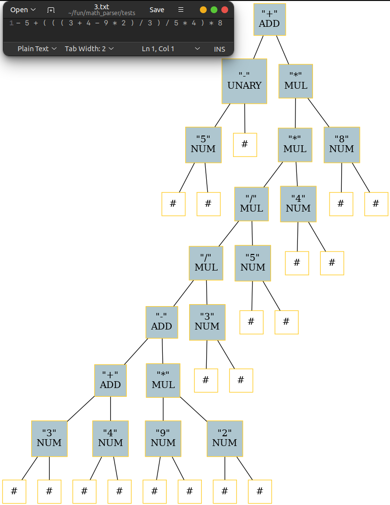

# Math2AST

## Simple Math Parser - Building a Abstrace Syntax Tree

This is a quick educational project to learn a bit about recursive descent parsing, since writing a compiler from scratch proved troublesome.

The objective is to parse mathematical expressions into an AST with the correct precedence, and then calculate the result.

To keep things simple, we will not be writing a proper lexer, since this is a one-day project and it's something I have tackled before.

As a result, the syntax of the mathematical expressions will be a little dumb - spaces between every token to make things simple:

Ex.
```
- 5 + ( ( ( 3 + 4 - 9 * 2 ) / 3 ) / 5 * 4 ) * 8
```

We get the following AST:


